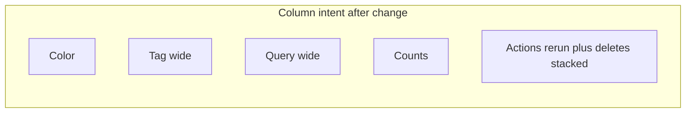

# AI search history table usability

## Context

The “history widget” is the **AI search rows table** rendered when `aiRows.length > 0` in `[AISearchPanel.tsx](src/sidebar/components/search/AISearchPanel.tsx)` (roughly lines 468–668). It is a standard `<table className="w-full ...">` that today has **eight columns** (rerun, color, tag, query, pending, total, delete pending, delete all). The target layout uses **five columns**: **Color**, **Tag**, **Query**, **Counts**, **Actions**—with **Actions** stacking **rerun (Redo icon)** on top of **delete pending** and **delete all** to save horizontal space. With no width hints today, the browser distributes space evenly across many columns, so **Tag** and **Query** end up too narrow despite `break-all`.

There is **no separate component** named HistoryWidget; all changes live in this file unless you later extract a small presentational subcomponent.

## 1. Make Tag and Query the widest columns

- Add `**table-fixed`** (Tailwind) on the `<table>` so column widths are predictable.
- Define widths with `**colgroup` + `col`** (or equivalent `th`/`td` width classes consistent with `table-fixed`). Suggested pattern:
  - **Color**: fixed narrow (color input).
  - **Tag**: large fraction of remaining space (e.g. **~40–45%** of table width).
  - **Query**: large fraction (e.g. **~40–45%**).
  - **Counts**: fixed/min width for `12 | 34` style content.
  - **Actions**: single narrow column for **three stacked icon buttons** (rerun + two deletes); slightly taller row height than today, but one fewer column gives Tag/Query more width.
- Keep `**break-all`** (or `**break-words`**) on tag/query cells as needed so long tokens still wrap without overflow; `**min-w-0`** on those `<td>`s can help inside fixed layouts in some flex/table combinations.

### Smaller text in Tag and Query (preserve space)

- The table root already uses `**text-sm**` (`className` on `<table>`). To **reduce visual size and vertical footprint** for the long strings in Tag and Query only, apply a **step down** on those columns—for example `**text-xs`** (and `**leading-snug`** if line height feels too loose) on the **Tag** and **Query** `<th>` and matching `<td>` content, leaving other columns at the inherited `text-sm` so headers and controls stay readable.
- Avoid shrinking the whole table unless you want every column smaller; scoping keeps icon buttons, color input, and counts at the current scale.

## 2. Single “Actions” column (rerun + deletes stacked)

- Remove the **separate leftmost rerun column**; combine with the **delete** controls into **one rightmost column** titled **Actions** (or **“Actions”** in the `<th>`).
- **Vertical order** (top → bottom): **Rerun search** (existing **Redo** button, lines 534–553), **Delete pending** (Cancel icon), **Delete all** (Trash icon). Use a **flex column** with tight vertical gap (`flex flex-col items-center gap-0.5` or similar) inside one `<td>` per row.
- **Header**: visible **“Actions”** replaces both the old sr-only “Rerun” and separate delete headers—no ambiguous icon-only column. Optional `**sr-only`** on the `<th>` if you want a longer description for screen readers.
- **Hover / labels**: keep `**title`** and `**aria-label**` on **each** of the three buttons so users know which control is rerun vs delete pending vs delete all (the redo button already uses “Rerun search”; avoid calling it “Refresh” in `title` unless product explicitly wants that word).

## 3. Merge Pending + Total into one “Counts” column

- **Header**: one `<th scope="col">` titled **Counts** (optionally with a short `title` on the `<th>` summarizing both metrics).
- **Cell content**: single cell, e.g. `{pending} | {total}` with `**tabular-nums`** and `**text-right`** (or centered if you prefer).
- **Per-number hover text**: wrap each number in a ``:
  - Pending: explain **AI-generated / strict pending** annotations for this tag+query (align wording with existing helper behavior and the paragraph below the table).
  - Total: explain **all matching annotations** on this document—**manual, accepted, and pending** as you specified (can reuse concepts from the current footer copy at lines 660–666).
- **Accessibility**: keep counts meaningful for screen readers—e.g. `**aria-label`** on each span or one concise `**aria-label`** on the cell if spans are decorative.

## 5. Copy / footer paragraph

- The explanatory paragraph under the table (lines 660–666) partially duplicates what will move into **headers and `title`s**. After the layout change, **trim or adjust** that paragraph so it does not repeat the same long explanations three times, while still giving one-sentence context if useful.

## 6. Testing

- No dedicated `AISearchPanel` test file was found in the repo. **Manual check** in the sidebar: long tag and query strings wrap in wide columns; **Tag/Query text remains legible at the smaller size**; all **three** stacked action buttons remain clickable and tab-focusable; hover shows the right tooltips on each.
- If you have **Playwright / Cypress** or snapshot tests for this panel, update selectors only if markup structure changes (e.g. fewer `<th>` / `<td>`).

## Optional follow-up (out of scope unless you ask)

- Extract `**AISearchHistoryTable`** into a small component in the same folder for readability—only if the JSX becomes hard to maintain.

