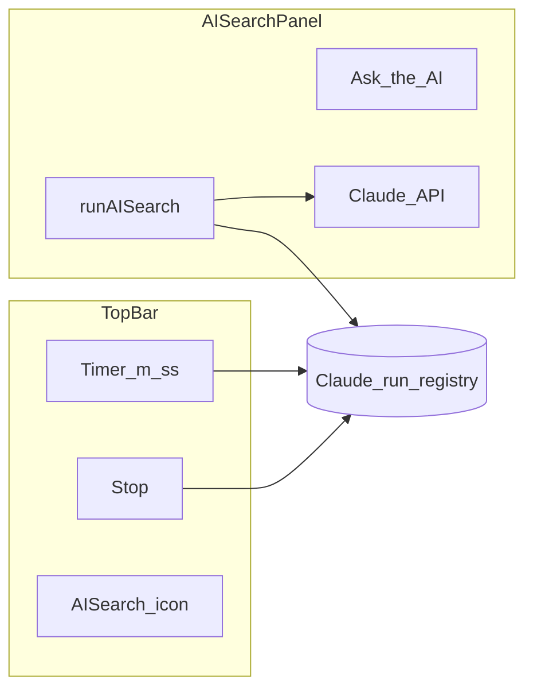

# AI Search: stop, timer, toasts, and disabled-state plan

## Current behavior (baseline)

- `[AISearchPanel.tsx](src/sidebar/components/search/AISearchPanel.tsx)`: `aiSearchBusy` wraps `onAISearch` and disables the `[SearchField](src/sidebar/components/search/SearchField.tsx)` while **any** AI work runs; `**actionRowBusy`** is true iff `aiSearchBusy || deletingRowId !== null || rerunningRowId !== null`—i.e. during **any** `runAISearch`-driven work, **or** while **any** row’s delete-pending / delete-all / rerun async is in flight. That ties **all** row action buttons to that single flag, so one busy row blocks **every** row’s actions.
- `[runAISearch](src/sidebar/components/search/AISearchPanel.tsx)` awaits `[claude.AISearchDocument](src/sidebar/services/claude.ts)` then creates annotations and updates the store—there is **no** abort signal today.
- `[ClaudeService.AISearchDocument](src/sidebar/services/claude.ts)`: `client.messages.parse(...)` accepts a second `RequestOptions` argument; Anthropic’s SDK supports `{ signal }` (same as `messages.create`).
- `[ToastMessengerService](src/sidebar/services/toast-messenger.ts)`: `notice` / `success` / `error`; duplicate `(type, message)` pairs are suppressed—**use distinct message text** each time an update should appear (e.g. `Deleting pending… 12/40` per iteration).

### Terminology: Claude registry vs Ask single-flight

- `**activeClaudeCount`** (Claude run **registry**): one entry per in-flight `AISearchDocument`. Drives **timer**, **Stop** visibility, and **passing `AbortSignal`** into Claude. **Not** the same scope as “Ask disabled.”
- **Ask single-flight (product rule)**: **Disable “Ask the AI”** for the **entire** `runAISearch` execution—delete-pending (rerun path), **Claude** call, and **annotation creation**—until that invocation finishes in `finally`, **or** early exit when **Claude** is **aborted** (no post-Claude work → `finally` still runs). **Stop / abort applies only while awaiting Claude** (see below); during delete loops or annotation creation there is **no** cancel—user waits—so **Ask** stays disabled until those phases complete (avoids local state diverging from the Hypothesis server).
- **Abort scope (this iteration)**: Only the **Claude HTTP** phase is cancellable. **Do not** abort bulk deletes or in-flight annotation creates; designing that without store/server drift is **deferred**. Timer + Stop appear **only** while Claude is in flight (`activeClaudeCount > 0`).

**Implementation**: Use `**runAISearchInFlight`** (or keep one well-named `useState`/ref count) **only** for “this `runAISearch` call is active” for **Ask** `disabled`. Use the **registry** for Claude-only UI (timer/stop). **Remove** the old ambiguous `aiSearchBusy` name in favor of these two clear roles, or one in-flight counter for `runAISearch` plus registry for Claude—do **not** duplicate the same boolean for both purposes.

## 1) Stop control + abort Claude (and unblock UI)

- Extend `ClaudeSearchRequest` / `AISearchDocument` to accept optional `**signal: AbortSignal`** and pass it through: `client.messages.parse({ ...params }, { signal })`.
- **Register** the `AbortController` in the runtime registry **only for the duration of** `await claude.AISearchDocument(...)`—**register immediately before** the call and **unregister in a `finally`** after the await (whether success, error, or abort). **No** registry entry during delete-pending loops or during `api.annotation.create` loops—those phases are **not** abortable in v1.
- Pass `controller.signal` only into `AISearchDocument`. **Stop** / `abortAll()` calls `abort()` on whatever Claude controller is currently registered (typically one under single-flight).
- **After** `await` resolves (or throws), if `**signal.aborted`**, **return immediately**—do **not** create annotations, call `store.addAnnotations`, `store.addAISearchRow` / `setAISearchRowAnnotationIds`, `experimentLog.logSearch`, or success toasts. Treat abort as silent or a single low-noise `notice` if you want explicit feedback (avoid error toasts for user-initiated cancel).
- **Catch** errors: if the SDK throws due to abort, detect via `signal.aborted` or `error.name === 'AbortError'` and do not show the generic “Failed to create annotations” error for that case.

This matches the recovery plan: the in-flight HTTP may still complete server-side, but **discarded** results must not run post-Claude work.

## 2) Timer `m:ss` + placement (left of AI Search icon)

- Add a compact **digits-only** label (e.g. `tabular-nums`, `text-xs`, `text-color-text-light`) showing elapsed time `**floor(elapsedSec / 60):ss`** with zero-padded seconds, updating every second while **at least one** Claude run is active.
- **Elapsed reference**: the timer shows elapsed time for the **most recently started** in-flight Claude request only. Track `startedAt` per run; display `**Date.now() - max(startedAt)`** among **active** runs (equivalently: reset the displayed epoch whenever a new Claude call registers so the clock matches the latest request). **Rationale**: with **single-flight** Ask, only **one** `runAISearch` should run at a time from the panel; brief overlap is an edge case (e.g. programmatic double-fire); timer follows the **newer** Claude start.
- Render in the top bar **immediately to the left** of `[AISearchIconButton](src/sidebar/components/search/AISearchIconButton.tsx)` in `[TopBar.tsx](src/sidebar/components/TopBar.tsx)` (same flex group as today’s `AISearchIconButton` / `SearchIconButton`).
- **State wiring**: because `TopBar` and `AISearchPanel` are siblings under `[HypothesisApp](src/sidebar/components/HypothesisApp.tsx)`, share Claude run state without Redux. **Most minimal**: a **small module** (singleton `Map` of run id → `{ startedAt, AbortController }`, plus `subscribe` / `getSnapshot` for active count and timer anchor) consumed via `**useSyncExternalStore`** in `TopBar` and `AISearchPanel`—no `Provider`, no edits to the app root. **Preact context** is an alternative if you want an explicit tree boundary; it is **more** wiring than the module approach. Keep `AbortController` instances **only** in that module, not in Redux.

## 3) Stop icon

- Place a **stop** control (reuse an existing icon from `@hypothesis/frontend-shared` if available, e.g. `CancelIcon` with `title="Stop AI search"`, or add a dedicated stop glyph) **between** the timer and `AISearchIconButton`.
- `**abortAll()`**: call `abort()` on the registered Claude `AbortController`(s) and clear the registry. **Only** meaningful while Claude is in flight; **no-op** if nothing is registered (e.g. during deletes or annotation creation—timer/stop are hidden then anyway).
- Visibility: show timer + stop **only** while `**activeClaudeCount > 0`** (i.e. only during the Claude wait). Same window as the only phase where abort is supported.

## 4) Toast step messages

Implement phase notices (use `toastMessenger.notice` with `autoDismiss: false` during long steps if needed). `**_addMessage` dedupes identical `(type, text)`**—ensure each toast you care about has **distinct text** (e.g. `Deleting pending… 12/40` updates as work progresses; static lines like “Waiting on model” once per logical run). If two flows could emit the same static string in overlapping cases, add a minimal disambiguator (suffix) so the second is not suppressed. No new toast APIs or dismiss/replace helpers.

- **Throttle progress toasts**: For repeating **step** messages (especially `Deleting pending… i/n` and any similar progress line), emit a **new** update at most **once per second** (1000 ms min interval between `notice` calls for that phase). Always send the **first** message when a phase starts and the **last** when it ends (even if under one second since the prior update) so the user sees start, current progress, and completion.

| Phase                    | Example copy (from your plan)                                                |
| ------------------------ | ---------------------------------------------------------------------------- |
| Delete loop (rerun path) | `Deleting pending… 12/40` (throttled: ≤1 new toast/sec; first + last always) |
| Claude request           | `Waiting on model` (or `Waiting on model…`)                                  |
| Annotation create loop   | `Creating annotations…`                                                      |

- **Rerun** (`onRerunRow`): toast **Deleting…** during `annotationsService.delete` loop; then **Waiting…** around `AISearchDocument`; then **Creating…** around `api.annotation.create` loop in `runAISearch` (or factor shared helpers so phases are explicit).
- **Direct Ask** (`runAISearch` without prior deletes): **Waiting…** then **Creating…** only.

## 5) “Ask the AI” obviously disabled

- `[SearchField](src/sidebar/components/search/SearchField.tsx)`: when `disabled` is true and `fullWidthSubmitLabel` is set, keep the **textarea** aligned with existing sidebar search styling: `**disabled:text-grey-6`** (already used on the multiline field) whenever the Ask flow is disabled—do not add extra grayscale/opacity on the textarea beyond that pattern.
- Apply **stronger** disabled affordances on the full-width **“Ask the AI”** `[Button](src/sidebar/components/search/SearchField.tsx)` only (e.g. `opacity-50`, `cursor-not-allowed`, or other emphasis) so the primary action reads clearly disabled while the input stays visually consistent with other disabled search fields.

## 6) When to disable “Ask the AI”

**Product rule: single-flight.** The user cannot start another Ask while a `runAISearch` is already running (entire flow: deletes → Claude → creates). **Stop** only applies **during the Claude wait**: abort skips post-Claude work and `runAISearch` exits so Ask can re-enable in `finally`. **While deletes or annotation creates run**, there is **no** Stop—Ask stays disabled until that work finishes (cannot cancel without risking client/server mismatch).

- **Do not** tie Ask to `hasSelection` / `store.hasSelectedAnnotations()`. Selection is relevant for the **filter** search field (`[SearchPanel](src/sidebar/components/search/SearchPanel.tsx)`), but choosing annotations in the sidebar and asking the AI are **unrelated**—keep Ask enabled when annotations are selected (remove the current `disabled={hasSelection || …}` coupling for the AI search field).
- **Disable “Ask the AI”** when: `**runAISearchInFlight || rerunningRowId !== null || deletingRowId !== null`**. Same predicate for **all** cases: a `runAISearch` pipeline is running, **or** a row **rerun** is in progress (`rerunningRowId`), **or** a row **delete pending** / **delete all** is in progress (`deletingRowId`). Any row action keeps Ask off until that action finishes and the ids clear.
- `**runAISearchInFlight`**: set true at the start of `runAISearch`, false in `finally` (covers post-Claude annotation creation as well as Claude—**not** only `activeClaudeCount`).

## 7) Row action buttons: global lock + same predicate as Ask

- **Disable every row’s action buttons** (rerun, delete pending, delete all) when: `**runAISearchInFlight || rerunningRowId !== null || deletingRowId !== null`**. That prevents row rerun/delete from overlapping a running `runAISearch`, and prevents starting another row action while **any** row action is still running.
- **Per-button** checks still apply where they already do (e.g. delete pending disabled if `pendingCount === 0`, delete all if `totalCount === 0`, `documentURL` missing)—combine with the same predicate: e.g. `const globalRowLock = runAISearchInFlight || rerunningRowId !== null || deletingRowId !== null` then `disabled = globalRowLock || …` per button (or inline the expression; **globalRowLock** is only a readable name for that boolean, not extra state).

## 8) Concurrency + ordering

- **Single-flight from the panel**: Do **not** allow a second `runAISearch` from Ask while one is in flight (`runAISearchInFlight`). Entry points that call `runAISearch` (e.g. row **rerun**) should **not** start a second overlapping `runAISearch` for the same logical operation—**guard** duplicate reruns (`rerunningRowId === row.id`).
- **Claude-only abort**: **Each** Claude call uses an `**AbortController`** registered **only** for that await; **Stop** aborts the in-flight Claude request (typically one). **Future work**: cancellable deletes / annotation creation—**out of scope** here.
- **Completion handler**: after `AISearchDocument`, **always** check `signal.aborted` before any state mutation (see §1). Stale HTTP completions must not mutate state.
- **Edge case**: If two `runAISearch` invocations ever overlap (bug or future change), **last completion wins** is unsafe without row-level tokens—single-flight avoids this for the main path.

## Files to touch (expected)

| Area                                        | Files                                                                                                                                                                                                                        |
| ------------------------------------------- | ---------------------------------------------------------------------------------------------------------------------------------------------------------------------------------------------------------------------------- |
| Abort + API                                 | `[src/sidebar/services/claude.ts](src/sidebar/services/claude.ts)`                                                                                                                                                           |
| Runtime (registry + `useSyncExternalStore`) | New small module under `src/sidebar/components/search/` or `src/sidebar/services/` (no `HypothesisApp` wrapper required)                                                                                                     |
| Top bar UI                                  | `[TopBar.tsx](src/sidebar/components/TopBar.tsx)`, new `AISearchClaudeControls.tsx` (timer + stop)                                                                                                                           |
| Panel logic                                 | `[AISearchPanel.tsx](src/sidebar/components/search/AISearchPanel.tsx)` — `runAISearch`, `onAISearch`, `onRerunRow`, row disabled logic, toasts                                                                               |
| Ask styling                                 | `[SearchField.tsx](src/sidebar/components/search/SearchField.tsx)`                                                                                                                                                           |
| Tests                                       | Extend `[AISearchPanel` tests if any](src/sidebar/components/search/test/), `[SearchField-test.js](src/sidebar/components/search/test/SearchField-test.js)`, `[claude` service tests](src/sidebar/services/test/) if present |

## Risks / notes

- **Anthropic browser SDK**: confirm aborted requests surface as expected (abort vs generic `Error` wrapping in `ClaudeService` today—may need to **rethrow** `AbortError` or check `cause`).
- **Toast churn**: addressed by **§4**—at most one new progress toast per second, with first and last updates always sent.
- **Why not abort deletes/creates**: stopping mid-delete or mid-create risks **local store vs Hypothesis API** inconsistency; limiting abort to Claude keeps behavior tractable. Revisit in a later change if needed.

