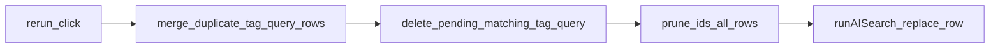

# Rerun button on AI search history rows

## Context (current behavior)

- History UI and table: `[src/sidebar/components/search/AISearchPanel.tsx](src/sidebar/components/search/AISearchPanel.tsx)`.
- `onAISearch(query)` uses **React state** `schemaTag` and `query` from the search field; it creates annotations with `tags: ['ai-pending', ...(schemaTag trimmed ? [schemaTag] : [])]` and `text: query`, then `store.addAISearchRow({ id, schemaTag, query, annotationIds })`.
- Row type: `[AISearchRow](src/sidebar/store/modules/sidebar-panels.ts)` in `[src/sidebar/store/modules/sidebar-panels.ts](src/sidebar/store/modules/sidebar-panels.ts)`. There is **no** update-row action today—only `addAISearchRow` / `removeAISearchRow`.

## Icon

`[@hypothesis/frontend-shared](node_modules/@hypothesis/frontend-shared/lib/components/icons/index.js)` exports `**RefreshIcon`** (reload) and `**RedoIcon`** (curved arrow). Prefer `**RefreshIcon`** for “rerun” semantics; both are already in the dependency.

## UI placement

- Add a **first** column (before “Color”) with a compact icon button, `title`/`aria-label` like “Rerun search”, using the same padding/hover pattern as the existing delete button in the same file.
- Add a matching `<th>` with `sr-only` text (e.g. “Rerun”) for accessibility.
- Keep delete in the **last** column so rerun and delete stay maximally separated.

## Behavior

1. **Scope**: Match `[onAISearch](src/sidebar/components/search/AISearchPanel.tsx)` and only consider annotations on the **current AI document** (`documentURL = claude.firstPDFURI(store.searchUris())`), same as creation. If `userid` / `groupId` / `documentURL` is missing, show the same toast as `onAISearch` and return.
2. **Collapse duplicate history rows (rerun only)**: The table can contain **multiple rows** with the same `schemaTag` and `query` (after trim) but different `annotationIds`. On rerun, **merge** those into **one** row **before** deleting annotations or calling Claude:
  - **Keep** the clicked row’s `id` (canonical row for `replaceRowId`).
  - **Union** all `annotationIds` from every row matching the same `(trim(schemaTag), trim(query))` into that row.
  - **Remove** the other duplicate rows from `aiSearch.rows`. Reuse `removeAISearchRow`-style cleanup for `schemaTagColors` when a tag has no rows left (unchanged when merged rows shared the same tag).
  - New store action, e.g. `mergeAISearchRowsWithSameTagQuery(keepRowId: string)`.
3. **Identify “pending” annotations to remove**: For each saved annotation on `documentURL`, treat as a candidate if:
  - `tags` includes `ai-pending`, and
  - tags match the same shape as creation: `['ai-pending']` when schema tag is empty after trim, else `['ai-pending', trimmedSchemaTag]`, and
  - `annotation.text` matches the row’s `query` (typically `trim()` on both sides).
4. **Delete**: For each match, `await annotationsService.delete(ann as SavedAnnotation)` (same as `onDeleteRow`).
5. **Prune history IDs (required, all rows)**: After deletes, remove deleted annotation IDs from **every** `AISearchRow.annotationIds`. Not optional. New action, e.g. `removeAnnotationIdsFromAISearchRows(ids: string[])`, in `[sidebar-panels.ts](src/sidebar/store/modules/sidebar-panels.ts)`.
6. **Re-run search**: Refactor `onAISearch` into `runAISearch(schemaTag: string, query: string, options?: { replaceRowId?: string })` that:
  - Performs the same Claude call, quote loop, `api.annotation.create`, and `store.addAnnotations` as today.
  - If `replaceRowId` is set: set that row’s `annotationIds` to the newly created IDs (single refreshed row).
  - If not set: `addAISearchRow` with a new `crypto.randomUUID()` (unchanged).
7. **Wire SearchField**: `onAISearch` calls `runAISearch(schemaTag.trim(), query)` without `replaceRowId`.
8. **Wire rerun**: `onRerunRow(row)` → loading → **merge duplicates** → delete pending → **prune** → `runAISearch(..., { replaceRowId: keptRowId })` → clear loading; same toasts as today.

## Tests / persistence

- Extend `[src/sidebar/store/modules/test/sidebar-panels-test.js](src/sidebar/store/modules/test/sidebar-panels-test.js)` for the new reducer(s): **merge** duplicate tag+query rows (union ids, drop extra rows); update row annotation IDs; **prune-by-ids across all rows**.
- `[PersistedAISearchService](src/sidebar/services/persisted-ai-search.ts)` already persists `sidebarPanels.aiSearch`; no change needed if row shape stays the same.

## Files to touch (minimal)

| File                                                                              | Change                                                                                                                                                           |
| --------------------------------------------------------------------------------- | ---------------------------------------------------------------------------------------------------------------------------------------------------------------- |
| `[AISearchPanel.tsx](src/sidebar/components/search/AISearchPanel.tsx)`            | Refactor `onAISearch`, add delete-matching helper, rerun handler, new column + `RefreshIcon` import                                                              |
| `[sidebar-panels.ts](src/sidebar/store/modules/sidebar-panels.ts)`                | `MERGE_AI_SEARCH_ROWS_SAME_TAG_QUERY` (keep row id, union ids, remove duplicates) + update row IDs + `REMOVE_AI_SEARCH_ANNOTATION_IDS`, action creators, exports |
| `[sidebar-panels-test.js](src/sidebar/store/modules/test/sidebar-panels-test.js)` | Tests for new reducers                                                                                                                                           |

No new markdown/docs unless you ask for them.