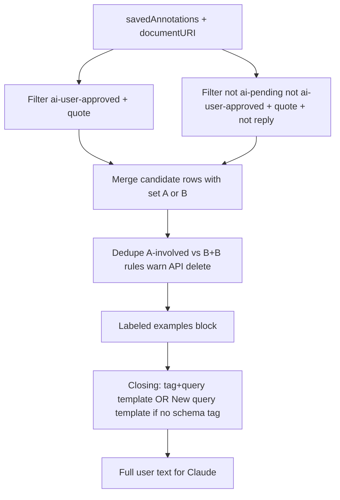

# Claude user message: example triples + templated question

## Goal

When the user runs AI search from the panel, the **user** message sent to Claude (the `text` part after the PDF `document` block in `[claude.ts](src/sidebar/services/claude.ts)`) should be built as:

1. **Collect triple rows** (in memory — each row ties to a source annotation for dedupe/delete; rendered list is `{ tag, query, quote }`):
  - **Set A — AI user–approved**: saved annotations on the **current PDF URI** with tag `ai-user-approved`, excluding `ai-pending` from the tag column (same schema-tag rules as before: strip `ai-user-approved` and `ai-pending` for display; join any remaining tags for the tag field).
  - **Set B — User-authored**: saved annotations on the same URI that are **not** tagged `ai-pending` or `ai-user-approved`, and that represent anchored extractions with a document quote (use `quote()` from `[annotation-metadata.ts](src/sidebar/helpers/annotation-metadata.ts)`; skip if no quote). **Default scope**: top-level annotations only (`!isReply`) so replies do not duplicate or confuse triples; note in code if you later want replies included. **Highlights with no `annotation.text`**: include in Set B **only when** `annotation.tags` has at least one entry; if no body text **and** no tags, **skip** the annotation.
  - **Deduplicate** (see **Deduplication and Set A cleanup** below) before formatting the examples block.
2. **Prepend a short, explicit label** that these rows are **examples of tag–query–retrieved quote triples** (exact wording can be stable copy, e.g. a heading + one line per row with clear `tag` / `query` / `quote` labels). **Per-row tags**: if an example has no tag (empty after stripping), **leave the tag position empty** in that row’s formatting — do **not** substitute the placeholder text “no tag” or similar. **Per-row query**: if `annotation.text` is empty, **leave the query position empty** — do **not** use placeholders such as “no text” or “(empty)”.
3. **Append the closing question** after the examples block (after the label + rows):
  - **When `schemaTag` is non-empty** (after trim): use the full template, e.g.  
   `What retrieved verbatim quotes from the document would go with the tag "{schemaTag}" and the query "{searchQuery}"?`
  - **When `schemaTag` is empty**: use this closing line instead:  
  `New query: {searchQuery}.`  
  (Literal prefix **New query:** so the model sees an explicit new request after the examples.)

## Why user message, not system prompt

`[ClaudeService.AISearchDocument](src/sidebar/services/claude.ts)` already separates:

- `**system`**: fixed role instruction only (see **System prompt** below) — **not** the example triples or closing question.
- `**messages[0].content`**: `[document PDF]`, then `**text`**: full user message (examples + closing).

All example triples and the templated question belong in that `**text**`, in order: **(label + rows) → (closing line)**. Do **not** duplicate the examples block into `system`.

## System prompt (Claude)

Replace the current `system` string in `[claude.ts](src/sidebar/services/claude.ts)` with exactly:

`You return verbatim quotes from the document at hand that answers or otherwise fulfills the user query.`

## Deduplication and API cleanup

Apply **after** building the candidate list from Sets A and B, each row carrying **tag**, **quote**, and **query** strings as used for display (same normalization everywhere), plus **annotation id** and **set** (`A` | `B`).

Use a **fixed normalization** for comparisons (e.g. trim whitespace on the strings you render).

### When at least one row is Set A (A+A, A+B, …)

- **Duplicate iff** normalized **tag** and **quote** are equal. **Query is not part of the duplicate test** — if tag+quote match and any participant is Set A, the group is a duplicate cluster.
- **On collapse**: `console.warn` (ids, sets, tag+quote).
- **Which row to keep**: if any member is **Set B**, keep one **Set B** row (deterministic, e.g. lowest id); if **all** are **Set A**, keep one **Set A** row. The surviving row’s **query** is that annotation’s query.
- **Deletes**: `await` **[AnnotationsService.delete](src/sidebar/services/annotations.ts)** (or equivalent) for every **eliminated** annotation that is **Set A**. For **A+B** with same tag+quote: keep B, delete A. For **A+A**: keep one A, delete the other A(s).

### When both rows are Set B only (B+B)

- **Not** duplicate on tag+quote alone if **query** differs — **both rows stay** in the example list.
- **Duplicate iff** normalized **tag**, **quote**, and **query** are all equal.
- **On collapse**: `console.warn`, then **delete one** of the two annotations via the Hypothesis API (keep one deterministically, e.g. lower id; delete the other **Set B** annotation). Same service as above.

Because deletes are async, `**collectTagQueryQuoteRows`** (or `collectDedupeAndDeleteTagQuoteRows`) should be `**async`** and accept `**annotationsService`**. [AISearchPanel](src/sidebar/components/search/AISearchPanel.tsx) already has it; `**buildClaudeAISearchUserMessage`** can take **already-deduped** rows.

## Timing (instrumentation)

- Measure **wall time** for constructing the final deduped example triples (the full `**collectTagQueryQuoteRows`** path: filter Sets A/B, build rows, dedupe, `await` API deletes — everything needed before `buildClaudeAISearchUserMessage` receives `rows`).
- Use `performance.now()` (or `Date.now()` if preferred) at start/end and `**console.log`** a single line with a stable prefix (e.g. `[AISearch] example triples construction`) and **elapsed milliseconds**.
- Purpose: establish a baseline; if the delay becomes noticeable in the UI, future work can optimize or move work off the critical path.

## Implementation sketch

1. **Helper module** (e.g. `[src/sidebar/helpers/claude-ai-search-user-message.ts](src/sidebar/helpers/claude-ai-search-user-message.ts)`) exporting something like:
  - `collectTagQueryQuoteRows(...): Promise<TagQueryQuoteRow[]>` (name can reflect dedupe+delete) — implements Sets A and B, then applies **Deduplication and API cleanup** (A-involved vs B+B rules), `console.warn` on each collapse, `await` deletes per that section; **wrap in timing** per **Timing** above. Takes `annotationsService` plus `documentUri` and `annotations`.
  - `buildClaudeAISearchUserMessage(params: { rows: TagQueryQuoteRow[]; schemaTag: string; searchQuery: string }): string` — formats labeled examples (empty tag and query slots where applicable), then appends either the tag+query template or `New query: {searchQuery}.` when `schemaTag` is empty.
2. **[AISearchPanel.tsx](src/sidebar/components/search/AISearchPanel.tsx)** `onAISearch(query: string)`:
  - Resolve `documentURL` with `claude.firstPDFURI(store.searchUris())` (already present).
  - `await collectTagQueryQuoteRows(...)` then `buildClaudeAISearchUserMessage({ rows, ... })` (or one combined async helper).
  - Call `claude.AISearchDocument({ query: fullUserMessage, candidateURIs, apiKey })`.
3. **[ClaudeService](src/sidebar/services/claude.ts)** — set `**system`** to the string in **System prompt (Claude)** above (replacing the old “You extract relevant passages…” line). The `query` parameter remains the full user text passed through to `content` (rename to `userMessage` in a follow-up only if you want clarity; not required).

## Triple semantics (refined)

| Source        | Tag column                                                                                                                     | Query column                                                                     | Quote column        |
| ------------- | ------------------------------------------------------------------------------------------------------------------------------ | -------------------------------------------------------------------------------- | ------------------- |
| AI-approved   | User schema tag(s), after removing `ai-user-approved` and `ai-pending` — **may be empty** (e.g. only system tags were present) | `annotation.text` (original AI search query stored on create)                    | `quote(annotation)` |
| User-authored | All `annotation.tags` (no AI system tags expected), or empty                                                                   | `annotation.text` (user’s note), or **empty** for tagged highlights with no body | `quote(annotation)` |

**User-authored highlights, no body text**: eligible for a row **only if** at least one tag exists; the **query** column is then rendered **blank** (same rule as an empty tag column).

When rendering example rows, an **empty tag** or **empty query** is shown as **empty** (blank field), not a verbal placeholder.

Skip rows with empty/missing **quote**. Skip user-authored highlights with no body text **and** no tags.

## Tests

- Helper tests: URI filtering, approved vs human sets, reply exclusion, tag stripping for AI-approved, **empty schema tag → closing line is `New query: {searchQuery}.`**, **non-empty schema tag → full template**, **example row with empty tag renders blank tag slot**, **tagged highlight with empty `annotation.text` is included and query column renders blank**, **untagged highlight with empty text is excluded**.
- **Dedupe tests** (mocked `annotationsService.delete`): **A+A / A+B**: same normalized tag+quote → collapse; **A+B** keeps B, deletes A; **A+A** keeps one A, deletes other(s); `**console.warn`** on each collapse. **B+B**: same tag+quote **but different query** → **two rows**, no delete. **B+B**: same tag+quote+query → one row, **one B deleted** via API. **B+B** identical triple: keep/delete rule deterministic (e.g. by id).

## Out of scope (unless requested)

- Token limits / truncation for very large triple lists.
- Persisting triple rows outside the Claude request (they are derived from annotations on each search).

