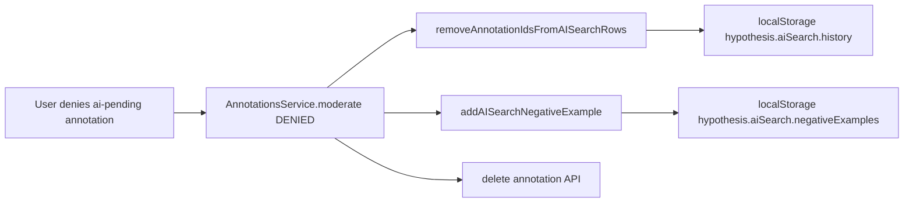

# Declined ai-pending annotations (local negative examples)

## Terminology (important)

- **Declining** means moderation **DENIED** on an **annotation** (`ai-pending`). We are not “declining” **history widget rows** (`AISearchRow` = one AI search run with `schemaTag`, `query`, `annotationIds[]`).
- What we **persist** are **snapshots** of declined **annotations** (tag / query / quote / document), for local negative training.

## Context (current behavior)

- Approving `ai-pending` updates tags via API and keeps the annotation (`[AnnotationsService.moderate](src/sidebar/services/annotations.ts)` ~336–362).
- Denying `ai-pending` deletes the **annotation** and does not call the moderation API (`[moderate](src/sidebar/services/annotations.ts)` ~365–367). Nothing today records that triple for later use.
- AI search **history** is `[AISearchState](src/sidebar/store/modules/sidebar-panels.ts)` (`rows` + `schemaTagColors` only), hydrated and persisted by `[PersistedAISearchService](src/sidebar/services/persisted-ai-search.ts)` under `hypothesis.aiSearch.history`, with cross-tab sync via `storage` / `visibilitychange` / `focus`.

## Data model (separate from history widget state)

- Add `AISearchNegativeExample`: `{ id: string; schemaTag: string; query: string; quote: string; documentUri: string }` — one record per **declined annotation** snapshot (stable `id` for list UI / removal).
  - `schemaTag`: from the annotation’s tags with `ai-pending` removed (e.g. `tags.filter(t => t !== 'ai-pending').join(', ')`).
  - `query`: annotation body text (the AI “query” for that pending highlight).
  - `quote`: from `[metadata.quote](src/sidebar/helpers/annotation-metadata.ts)` (`TextQuoteSelector.exact`).
  - `documentUri`: `annotation.uri` so negatives for other PDFs are not mixed into the current document’s prompt.
- **Do not** add this array to `[AISearchState](src/sidebar/store/modules/sidebar-panels.ts)` / `aiSearch`. Keep `AISearchState` limited to **history** (`rows`, `schemaTagColors`).
- Add a **separate** field on `sidebarPanels` state, e.g. `aiSearchNegativeExamples: AISearchNegativeExample[]` (default `[]`), with its own reducers (`ADD_AI_SEARCH_NEGATIVE_EXAMPLE`, `REMOVE_AI_SEARCH_NEGATIVE_EXAMPLE`, `HYDRATE_AI_SEARCH_NEGATIVE_EXAMPLES`).

This avoids conflating concepts and **does not require** changing `[ADD_AI_SEARCH_ROW](src/sidebar/store/modules/sidebar-panels.ts)` / `[REMOVE_AI_SEARCH_ROW](src/sidebar/store/modules/sidebar-panels.ts)` for merge hygiene.

## Actions / selectors

- `addAISearchNegativeExample(example)` — append if not duplicate by `(documentUri, schemaTag.trim(), query.trim(), quote)`.
- `removeAISearchNegativeExample(exampleId)` — user cleanup.
- Selector `aiSearchNegativeExamples()` reading the new field.

## Capture on deny (`[AnnotationsService.moderate](src/sidebar/services/annotations.ts)`)

When `isAiPending && newStatus === 'DENIED'` and `annotation.id` is set:

1. `metadata.quote(annotation)` — if null/empty, skip recording.
2. `this._store.removeAnnotationIdsFromAISearchRows([annotation.id])` so **history** rows stay accurate when that annotation is deleted.
3. `this._store.addAISearchNegativeExample({ ... })` (dedupe).
4. Existing `await this.delete(annotation)`.

## Persistence (same durability as history, separate storage)

- **New** `localStorage` key, e.g. `hypothesis.aiSearch.negativeExamples`, holding a JSON array of validated objects (same shape as `AISearchNegativeExample`).

### Extend `PersistedAISearchService` (single service, two pipelines)

Keep **one** service registered in `[initServices](src/sidebar/index.tsx)` so startup stays simple. Implement the negative-example pipeline alongside the existing history pipeline in `[persisted-ai-search.ts](src/sidebar/services/persisted-ai-search.ts)`:

1. **Constants** — e.g. `AI_SEARCH_NEGATIVE_EXAMPLES_KEY = 'hypothesis.aiSearch.negativeExamples'` (exported for tests).
2. **Parse** — add `parseAISearchNegativeExamplesState(raw: unknown): AISearchNegativeExample[] | null` with the same validation style as `parseAISearchState` (reject malformed entries; return `null` if the whole payload is invalid). Keep `[parseAISearchState](src/sidebar/services/persisted-ai-search.ts)` **only** for history; do not mix the two shapes in one parser.
3. **Hydrate** — store action `hydrateAISearchNegativeExamples(examples: AISearchNegativeExample[])` (or equivalent) on `sidebarPanels`.
4. **Init** — after the existing history hydrate, `getObject` the new key → parse → if valid, dispatch hydrate for negative examples; if missing/invalid, hydrate `[]`.
5. **Write path** — second `[watch](src/sidebar/util/watch.ts)` on `() => store.getState().sidebarPanels.aiSearchNegativeExamples` (or a small selector), deep-compare with `JSON.stringify`, `setObject` to the **negative-examples** key only.
6. **Cross-tab read path** — factor the existing `syncFromLocalStorage` logic into an internal helper that accepts `(storageKey, parseFn, applyHydrate)` **or** duplicate the `storage` / `visibilitychange` / `focus` wiring for the second key only (second listener branch when `e.key` matches). Goal: when another tab writes `hypothesis.aiSearch.negativeExamples`, this tab re-parses and hydrates without duplicating bugs—prefer one shared helper used twice with different arguments.

**Single file:** Keep both persistence pipelines in `[persisted-ai-search.ts](src/sidebar/services/persisted-ai-search.ts)`; do not split this module into separate files.

**Registration** — still `persistedAISearch.init()` once; no new injector token.

## Claude user message (`[claude-ai-search-user-message.ts](src/sidebar/helpers/claude-ai-search-user-message.ts)`)

- **Positive examples:** today `[buildClaudeAISearchUserMessage](src/sidebar/helpers/claude-ai-search-user-message.ts)` always emits `Examples of tag-query-quote triples:\n\n` even when `rows` is empty. Change the plan so the **entire** positive block (that header plus the `- tag: …` lines) is **omitted** when there are no positive triples (`rows` empty after `collectTagQueryQuoteRows`). Do not emit a bare header with no rows.
- **Negative examples:** only when `negativeExamples` for the current document is non-empty: after any positive block (if present), output a line `Negative examples of tag-query-quote triples:` then one line per example: `{tag} {query} should not return {quote}` (trim / spacing).
- **Final question** (`What retrieved verbatim…` or `New query: …`) always follows the optional blocks; ordering when both are empty is: no example sections, then the question only.

## `[AISearchPanel.tsx](src/sidebar/components/search/AISearchPanel.tsx)`

- In `runAISearch`, filter `store.aiSearchNegativeExamples()` by `documentUri === documentURL`, pass into `buildClaudeAISearchUserMessage`.
- **UI (below the history table):** wrap stored negative examples in a **collapsible** region, **collapsed by default**, with a small title **“User-denied AI annotations”** (click/tap header to expand). When expanded, show the list/table with per-row remove as before. Use local component state for open/closed (no need to persist expanded state unless you add that later).

## Tests

- `[annotations-test.js](src/sidebar/services/test/annotations-test.js)`: DENIED path with `TextQuoteSelector`; assert `removeAnnotationIdsFromAISearchRows` + `addAISearchNegativeExample`.
- `[sidebar-panels-test.js](src/sidebar/store/modules/test/sidebar-panels-test.js)`: negative example add/remove/dedupe; **no** coupling to `ADD_AI_SEARCH_ROW`.
- `[persisted-ai-search-test.js](src/sidebar/services/test/persisted-ai-search-test.js)` (or new test module): new key parse, migrate empty/missing, cross-tab sync if covered.
- `[claude-ai-search-user-message-test.js](src/sidebar/helpers/test/claude-ai-search-user-message-test.js)`: negative section when examples present; no positive header/body when `rows` empty; negatives-only and question-only cases.

