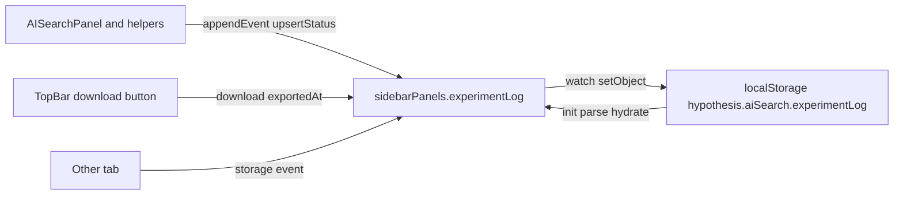

# Experiment log in PersistedAISearchService

## Context

Today `[PersistedAISearchService](src/sidebar/services/persisted-ai-search.ts)` persists two slices from `sidebarPanels`: `aiSearch` (`hypothesis.aiSearch.history`) and `aiSearchNegativeExamples` (`hypothesis.aiSearch.negativeExamples`). Each uses `parse*`, initial `init()` hydration, a `watch` that calls `setObject`, and `_syncFromLocalStorage` for `storage` / `visibilitychange` / `focus`.

The new feature follows the **same persistence wiring**, but the **stored value** is a versioned `**ExperimentLog`** object: a **single** append-only `events` array and a flat `**annotationStatuses`** map keyed by `annotationId`—**no `users` record** and no partitioning by account.

## Canonical type definitions

These types are the source of truth for the persisted shape. Implement them in `[sidebar-panels.ts](src/sidebar/store/modules/sidebar-panels.ts)` (or a colocated `experiment-log.ts` if you prefer—re-export from the module either way).

`ExperimentEvent` and `AnnotationStatus` may still include a `username` field on each row for optional human-readable export context; storage is **not** keyed or grouped by user.

```ts
export type ExperimentEvent =
  | {
      type: 'search';
      timestamp: string;
      username: string;
      documentUri: string;
      searchRowId: string;
      query: string;
      schemaTag: string;
      annotationIdsCreated: string[];
    }
  | {
      type: 'accept';
      timestamp: string;
      username: string;
      documentUri: string;
      annotationId: string;
      quoteText: string;
      schemaTag: string;
    }
  | {
      type: 'reject';
      timestamp: string;
      username: string;
      documentUri: string;
      annotationId: string;
      quoteText: string;
      schemaTag: string;
    }
  | {
      type: 'rerun-search';
      timestamp: string;
      username: string;
      documentUri: string;
      searchRowId: string;
      query: string;
      schemaTag: string;
      deletedAnnotationIds: string[];
    }
  | {
      type: 'delete-pending';
      timestamp: string;
      username: string;
      documentUri: string;
      searchRowId: string;
      query: string;
      schemaTag: string;
      deletedAnnotationIds: string[];
    }
  | {
      type: 'delete-all';
      timestamp: string;
      username: string;
      documentUri: string;
      searchRowId: string;
      query: string;
      schemaTag: string;
      deletedAnnotationIds: string[];
      untaggedAnnotationIds: string[];
    };

export type AnnotationStatus = {
  annotationId: string;
  username: string;
  documentUri: string;
  schemaTag: string;
  quoteText: string;
  searchRowId: string;
  query: string;
  status: 'suggested' | 'accepted' | 'rejected';
  createdAt: string;
  resolvedAt: string | null;
};

export type ExperimentLog = {
  version: 1;
  exportedAt?: string;
  events: ExperimentEvent[];
  annotationStatuses: Record<string, AnnotationStatus>;
};
```

**Notes for implementation:**

- **Discriminated union**: `parseExperimentLog` must branch on `event.type` and validate required fields per variant (same strictness style as `[parseAISearchState](src/sidebar/services/persisted-ai-search.ts)`).
- `**exportedAt`**: optional ISO timestamp on the persisted log; **set when the user downloads a snapshot** (successful save of JSON/blob) so you know a copy was taken; `watch` persists it like other fields.

## Data model (store slice)

- Add `**experimentLog: ExperimentLog`** to `sidebarPanels` state with default:
`{ version: 1, events: [], annotationStatuses: {} }` (omit `exportedAt` until set).
- **Accumulation + safety**:
  - Cap `**events`** length globally (FIFO trim after append), e.g. 500–2000 entries, so `localStorage` stays bounded. Define a constant `**EXPERIMENT_LOG_EVENTS_CAP`** (or equivalent) so UI and reducers share the same number for threshold math.
  - **Soft threshold (required):** when `events.length` reaches **80–90% of cap** (pick one fixed ratio, e.g. `0.85 * cap`), **offer download**—banner, inline prompt, or modal with a primary action to download the log as JSON (include `version`, `events`, `annotationStatuses`, and set `exportedAt` on the **downloaded file** to the snapshot time even if the store field is updated separately; see below).
  - **On successful download:** dispatch `**SET_EXPERIMENT_LOG_EXPORTED_AT`** with `**new Date().toISOString()`** so persisted state records that a snapshot was taken.
  - **First FIFO eviction (required):** the **first time** an append causes events to be trimmed (oldest dropped), show a **short notice**—e.g. `[ToastMessengerService](src/sidebar/services/toast-messenger.ts)` `warning` or `notice`—that older log events were removed and the user can download the log to keep history. **Once per browser session** (e.g. `sessionStorage` flag `hypothesis.aiSearch.evictionNoticeShown` or equivalent) so repeat appends at cap do not spam. Implementation must stay out of the reducer side-effect: e.g. detect trim in a `watch` subscriber, or compare pre/post in the code path that dispatches append, then toast + set session flag.
  - A hard FIFO cap still means **oldest events are discarded** after the cap; the threshold + download + `exportedAt` + eviction notice are the mitigation against silent loss.
- **Reducers / actions** (illustrative names—align with existing `makeAction` style):
  - `**HYDRATE_EXPERIMENT_LOG`** — replace entire `experimentLog` (load + cross-tab sync).
  - `**APPEND_EXPERIMENT_EVENT`** — `{ event: ExperimentEvent }`: append to `events`, apply FIFO cap.
  - `**UPSERT_ANNOTATION_STATUS`** or `**MERGE_ANNOTATION_STATUSES`** — update `annotationStatuses[annotationId]` when UI tracks suggested → accepted/rejected.
  - `**SET_EXPERIMENT_LOG_EXPORTED_AT`** — `{ exportedAt: string }` — **required** for the download flow; called when the user completes a snapshot download so `experimentLog.exportedAt` reflects that a copy was taken.
- **Selectors**: e.g. `experimentLog(state)`.

## Persistence layer (`[persisted-ai-search.ts](src/sidebar/services/persisted-ai-search.ts)`)

- New key: e.g. `**AI_SEARCH_EXPERIMENT_LOG_KEY = 'hypothesis.aiSearch.experimentLog'`**.
- `**parseExperimentLog(raw: unknown): ExperimentLog | null`**:
  - Require `version === 1`, `events` is an array, `annotationStatuses` is a non-array object.
  - Parse each event by `type`; parse each `AnnotationStatus` value.
  - Return `null` on any mismatch.
- `**emptyExperimentLog()`**: `{ version: 1, events: [], annotationStatuses: {} }`.
- `**init()`**: same pattern as existing keys—hydrate from storage, `watch` `sidebarPanels.experimentLog`, `_syncFromLocalStorage` for `storage` / focus / visibility.

## Instrumentation

Map UI flows to `**ExperimentEvent`** variants and, where needed, maintain `**annotationStatuses`** (e.g. suggested → accepted/rejected with `resolvedAt`).


| Event `type`        | Typical trigger                                             |
| ------------------- | ----------------------------------------------------------- |
| `search`            | After annotations created for a new search row              |
| `accept` / `reject` | User accepts or rejects a suggested / ai-pending annotation |
| `rerun-search`      | User reruns search; include `deletedAnnotationIds`          |
| `delete-pending`    | Pending annotations deleted in that flow                    |
| `delete-all`        | Bulk delete including `untaggedAnnotationIds`               |


Fill `**username`** on events/statuses from session only if you still want that string on each row; otherwise use a placeholder empty string or a follow-up change to drop the field from types.

## Top bar: manual download (left of profile)

The profile avatar is the `[ProfileIcon](src/sidebar/components/UserMenu.tsx)` inside `[UserMenu](src/sidebar/components/UserMenu.tsx)`. `**ProfileIcon` is not exported separately from the menu**—add the experiment-log control in `[TopBar.tsx](src/sidebar/components/TopBar.tsx)` **immediately before** `<UserMenu />` in the `isLoggedIn && controlEnabled(settings, 'account')` branch (same flex row as Help and the search icons), so it appears **to the left** of the profile menu / icon in LTR layout.

- Use the same patterns as other top-bar icon buttons (`[TopBarToggleButton](src/sidebar/components/TopBarToggleButton.tsx)` or a small icon button with `title` / `aria-label` e.g. “Download experiment log”).
- **Behavior:** trigger the **same JSON download + `SET_EXPERIMENT_LOG_EXPORTED_AT`** path as the soft-threshold prompt (extract a small helper or hook to avoid duplicating blob/download logic).
- **Inject** services as needed (`toastMessenger` for failures, store for `experimentLog`); follow `[withServices](src/sidebar/service-context.tsx)` / `[useSidebarStore](src/sidebar/store/index.ts)` like other components.
- Add `**data-testid`** for tests (e.g. `experiment-log-download-button`).

## Tests

- `**parseExperimentLog`**: invalid top-level; valid minimal `{ version: 1, events: [], annotationStatuses: {} }`; one fixture per `ExperimentEvent` variant; invalid nested event; valid `annotationStatuses` entries.
- `**PersistedAISearchService`**: hydrate, persist on change, `storage` sync (reuse negative-examples patterns).
- **Store**: append increases `events`; FIFO cap; status upsert; hydrate replace; `SET_EXPERIMENT_LOG_EXPORTED_AT` updates persisted shape.
- **UI / integration:** threshold detection uses same cap constant; download handler sets `exportedAt`; `[TopBar](src/sidebar/components/TopBar.tsx)` renders download control before `UserMenu`; first-eviction toast once per session.
- **TopBar test** (if present) or new test: button present when logged in + account enabled; click triggers download path (can mock blob / store).

## Out of scope (unless you ask)

- Full **browser UI** to browse or search the log (beyond **threshold prompt + TopBar download** described above).
- Server upload or analytics pipeline.
- Migrating pre-v1 storage (none yet).




