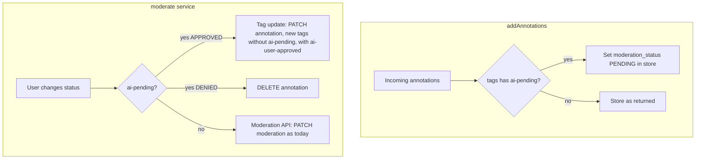

# Local moderation for `ai-pending` annotations

## Context

- AI suggestions are created with `[tags: ['ai-pending', ...]](src/sidebar/components/search/AISearchPanel.tsx)` via `api.annotation.create`, then `[store.addAnnotations(created)](src/sidebar/components/search/AISearchPanel.tsx)` runs.
- The moderation UI is gated by `[canModerate = annotation.actions?.includes('moderate')](src/sidebar/components/moderation/ModerationControl.tsx)`. Creators typically **do not** get the `moderate` action, so the dropdown never appears for their own annotations.
- `[moderate()](src/sidebar/services/annotations.ts)` always calls `api.annotation.moderate`, which you expect to **409** when the reviewer is the same user as the author.

## 1. Show the moderation control for `ai-pending`

**File:** `[src/sidebar/components/moderation/ModerationControl.tsx](src/sidebar/components/moderation/ModerationControl.tsx)`

Apply your condition:

```ts
const canModerate =
  annotation.actions?.includes('moderate') ||
  (annotation.tags?.includes('ai-pending') ?? false);
```

**Visibility note:** The early return that hides the control for `APPROVED` in non–pre-moderated groups ([lines 84–89](src/sidebar/components/moderation/ModerationControl.tsx)) only applies when `moderationStatus === 'APPROVED'`. After step 2, local `moderation_status` will be `PENDING` for `ai-pending` rows, so the control stays visible.

**Tests:** Extend `[src/sidebar/components/moderation/test/ModerationControl-test.js](src/sidebar/components/moderation/test/ModerationControl-test.js)` with a case: no `moderate` in `actions`, but `tags` includes `ai-pending`, expect `ModerationStatusSelect` (mirroring existing “can moderate” tests).

---

## 2. Normalize `moderation_status` when adding annotations to the store

**File:** `[src/sidebar/store/modules/annotations.ts](src/sidebar/store/modules/annotations.ts)` — inside the `addAnnotations` thunk, **before** `dispatch(makeAction(...))`:

- Map the incoming list: if `annot.tags?.includes('ai-pending')`, spread the annotation and set `moderation_status: 'PENDING'`.
- Use this mapped array for:
  - the `dispatch(makeAction(reducers, 'ADD_ANNOTATIONS', { annotations: ... }))` payload, and
  - the `added` filter used for anchoring timeout logic (so IDs/`$tag`s stay aligned with what is actually stored).

This keeps the server response as-is for persistence while the **sidebar store** shows a pending state so `[ModerationStatusSelect](src/sidebar/components/moderation/ModerationControl.tsx)` and `[moderationStatus](src/sidebar/components/moderation/ModerationControl.tsx)` line up.

**Tests:** Add a focused example in `[src/sidebar/store/modules/test/annotations-test.js](src/sidebar/store/modules/test/annotations-test.js)`: `addAnnotations` with an annotation that has `ai-pending` in `tags` and assert the stored annotation has `moderation_status === 'PENDING'`.

---

## 3. `moderate()`: tag swap for approve; branch for deny

**File:** `[src/sidebar/services/annotations.ts](src/sidebar/services/annotations.ts)`

Introduce a small helper or inline logic at the start of `moderate(annotation, newStatus)`:

### Approve (`newStatus === 'APPROVED'`) when `ai-pending` is present

- Do **not** call `api.annotation.moderate`.
- Build `tags`: remove `'ai-pending'`, append `'ai-user-approved'` if not already present (preserve other tags, e.g. schema tags).
- Call `api.annotation.update({ id: annotation.id }, { tags })` (PATCH body should be minimal—tags only unless you discover the API requires more).
- Merge `**$…` client fields** (e.g. `$tag`) from the original annotation into the result (same pattern as `[save()](src/sidebar/services/annotations.ts)` lines 308–315).
- Call `this._store.addAnnotations([merged])` and return merged.

**Answering your store vs server question:** After a successful `update`, use the **returned annotation** from the API as the source of truth. The server’s `moderation_status` for a normal (non–pre-moderated) annotation is typically already `APPROVED`; your local `PENDING` was store-only. If the PATCH response omits `moderation_status`, set `moderation_status: 'APPROVED'` on the object you pass to `addAnnotations` so the UI does not stay on `PENDING`.

There is **no** automatic full reload unless something else triggers `loadAnnotation` / search / stream—so updating the store from the PATCH response (plus optional explicit `moderation_status`) is the reliable approach.

### Deny (`newStatus === 'DENIED'` — the UI uses `DENIED`, not the word “declined”)

- **Expectation:** `moderate(DENIED)` is expected to **409** for the author the same way as approve (no moderator role). Do **not** call the moderation API for `ai-pending` deny; use **delete** so rejecting a suggestion removes the annotation without a 409.
- **Implementation:** When `annotation.tags?.includes('ai-pending') && newStatus === 'DENIED'`, call the existing `[delete(annotation)](src/sidebar/services/annotations.ts)` path (API DELETE + `removeAnnotations` in store) instead of `api.annotation.moderate`.

**Return value (deny branch):** After `await this.delete(annotation)`, **return** the same `annotation` reference passed in (before delete). `moderate` stays `Promise<Annotation>`; callers such as `[ModerationControl](src/sidebar/components/moderation/ModerationControl.tsx)` do not use the return value, but this keeps the type narrow and avoids widening to `Promise<Annotation | void>`.

**Tests:** Extend `[src/sidebar/services/test/annotations-test.js](src/sidebar/services/test/annotations-test.js)` `describe('moderate')`:

- `ai-pending` + `APPROVED`: assert `update` called with expected tags, `moderate` API **not** called, `addAnnotations` with merged result.
- `ai-pending` + `DENIED`: assert `delete` (or internal steps of delete) invoked, `moderate` API not called, and `moderate`’s resolved value is the same annotation reference passed in.

---

## 4. Optional consistency

- **Constants:** A single shared string constant for `'ai-pending'` / `'ai-user-approved'` reduces typos if you touch multiple files; keep scope minimal. (Tag palette for `ai-user-approved` is already handled in `[ai-search-tag-palette.ts](src/sidebar/helpers/ai-search-tag-palette.ts)`.)

---

## Flow (high level)

**Approve path, plain English:** When the user picks “approved” for an `ai-pending` annotation, we do **not** call the moderation API. Instead we send a normal **annotation update** request to the server (`PATCH` on the annotation resource—the same mechanism as editing tags in the editor). In that request, the `**tags` field** is set to a new list: `**ai-pending` is removed** and `**ai-user-approved` is added** (other tags, like a schema tag, stay). That is what the diagram abbreviates as “tag update.”




---

## Risks / follow-ups

- **Annotation `update` (PATCH) must be allowed for the author:** The approve path calls `api.annotation.update`—the same **edit-your-own-annotation** permission model as changing text or tags in the sidebar and clicking save. The server only applies the new `tags` if the authenticated user is **allowed to update** that annotation (Hypothesis uses the annotation’s `permissions.update` list, etc.). In your AI flow, the suggestion is created **as the current user** (`[AISearchPanel](src/sidebar/components/search/AISearchPanel.tsx)` uses their `userid` and `sharedPermissions`), so the reviewer is the **owner** of the row and should have update rights—**same as `save()`** on that annotation. This bullet is only a reminder: if update ever failed with **403 Forbidden** while moderation failed with **409**, you would debug server-side permissions or token identity, not the tag-swapping idea itself.
- `**moderate(DENIED)` for `ai-pending`:** Treated as **409-prone** like approve; implementation uses **delete** only (no moderation API for this branch). No alternate path to test unless your server behavior changes.

