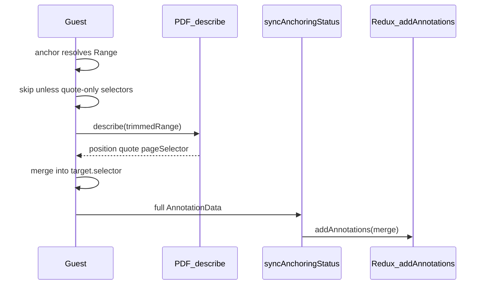

# PDF page + offset enrichment and sidebar sync

## Context

- PDF anchoring already resolves quote-only (or partial) selectors to a concrete `[Range](https://github.com/hypothesis/hypothesis-client/blob/main/src/annotator/guest.ts)` and can serialize a range back to selectors: `[describe(range)` in `pdf.ts](src/annotator/anchoring/pdf.ts)` returns `[TextPositionSelector, TextQuoteSelector, PageSelector]` (global `start`/`end` offsets plus `PageSelector.index`).
- The sidebar’s `[location()](src/sidebar/helpers/annotation-metadata.ts)` already reads `TextPositionSelector.start` as `charOffset` and `PageSelector.index` as `pageIndex` for ordering in `[compareByLocation](src/sidebar/helpers/thread-sorters.ts)`.
- Today, `[syncAnchoringStatus](src/sidebar/services/frame-sync.ts)` only destructures `{ $tag, $orphan }` and **drops** the rest of the annotation, so enriched selectors never reach the store even if the guest had them.

## Implementation

### 1. Merge helper (guest-side)

Add a small pure function (e.g. in `[src/annotator/util/merge-anchoring-selectors.ts](src/annotator/util/merge-anchoring-selectors.ts)` or next to anchoring code) that:

- Takes `existing: Selector[]` and `fromDescribe: Selector[]` (output of PDF `describe`).
- Produces a new array: keep existing selectors; **add** `TextPositionSelector` and `PageSelector` from `fromDescribe` if missing (by `type`); **do not** add a second `TextQuoteSelector` if one already exists (keep the API’s original quote).

### 2. Enrich after `locate`, before highlight

In `[src/annotator/guest.ts](src/annotator/guest.ts)` inside `anchor()`, after `const anchors = await Promise.all(annotation.target.map(locate))` and before the “removed while anchoring” check:

- **Guard (required):** Only run the extra `describe` + merge work for a target whose selectors are **quote-only** in the usual sense: there is **no** `TextPositionSelector`, `PageSelector`, `RangeSelector`, `ShapeSelector`, etc.—only quote(s). The straightforward way to test that is: `selectors.length > 0` and **every** selector is `TextQuoteSelector` (in practice this is almost always **exactly one** `TextQuoteSelector`; “every” is there to mean “no mixed selector types,” not “you need multiple quotes”). If any non–`TextQuoteSelector` appears, **skip** enrichment (no `describe` call).
- Add a small predicate (e.g. `isQuoteOnlySelectors(selectors: Selector[] | undefined)`) next to `mergeAnchoringSelectors` or inline in `guest.ts`.
- Do **not** import or call `isPDF()`; the same enrichment path applies wherever the current integration can `describe` a trimmed text range (PDF remains the motivating case).
- For each `Anchor` that passed the guard and has a **text** `region` (not `ShapeAnchor`): resolve a live `Range` via existing `resolveAnchor` / `TextRange.toRange()` (same as `highlight` uses).
- Call `this._integration.getAnnotatableRange(range)`; if `null`, skip.
- `const described = await this._integration.describe(this.element, trimmedRange)` (PDF integration returns a `Promise` from `[PDFIntegration.describe](src/annotator/integrations/pdf.tsx)`).
- Assign `target.selector = mergeAnchoringSelectors(target.selector, described)` (mutates the same `Target` objects referenced by `annotation.target`).

Handle failures with try/catch: on any error, leave selectors unchanged (quote-only behavior).

### 3. Sidebar: merge full annotation on `syncAnchoringStatus`

In `[src/sidebar/services/frame-sync.ts](src/sidebar/services/frame-sync.ts)`, extend the `syncAnchoringStatus` handler to accept the full `AnnotationData` payload (already typed in `[port-rpc-calls.d.ts](src/types/port-rpc-calls.d.ts)`):

- After existing `_updateAnchorStatus($tag, ...)`, call `this._store.addAnnotations([ann])` so `[ADD_ANNOTATIONS](src/sidebar/store/modules/annotations.ts)` merges `target` (and `$orphan`) into the existing row by `id` or `$tag`.

Ensure ordering: merging annotations should not break `_pendingHoverTag` / scroll logic (same `$tag` flow).

### 4. Tests

- **Guest**: unit or integration test that quote-only PDF selectors, after mocked `describe`, gain `TextPositionSelector` + `PageSelector` on `target[0].selector` (mock `Integration.describe` / `getAnnotatableRange`). Assert `describe` is not called when selectors already include a non–`TextQuoteSelector` type.
- **Frame-sync**: update/add a test that `syncAnchoringStatus` with a full annotation updates store `target` (existing tests in `[frame-sync-test.js](src/sidebar/services/test/frame-sync-test.js)` around `syncAnchoringStatus`).

### 5. Out of scope (explicit)

- Persisting enriched selectors to the Hypothesis API on save (optional follow-up; local sort works once the store has selectors).

## Files to touch (expected)

| Area           | File                                                                                                                                                                                         |
| -------------- | -------------------------------------------------------------------------------------------------------------------------------------------------------------------------------------------- |
| Enrich + merge | `[src/annotator/guest.ts](src/annotator/guest.ts)`, new merge helper                                                                                                                         |
| Sidebar merge  | `[src/sidebar/services/frame-sync.ts](src/sidebar/services/frame-sync.ts)`                                                                                                                   |
| Tests          | `[src/annotator/test/guest-test.js](src/annotator/test/guest-test.js)` (or focused new test), `[src/sidebar/services/test/frame-sync-test.js](src/sidebar/services/test/frame-sync-test.js)` |

