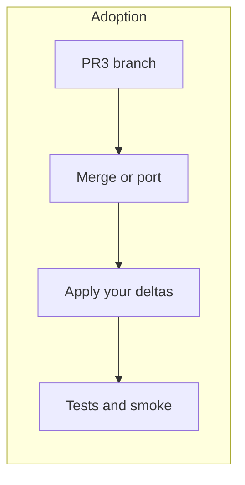

# Adopt PR #3 (“Logger”) with key changes

## Baseline (what PR #3 brings)

Use this as the default “take” unless you exclude something below:

| Area                   | PR content (typical)                                                                                                                                                                                                                                                                                                                                                                                                                                                                                                                                      |
| ---------------------- | --------------------------------------------------------------------------------------------------------------------------------------------------------------------------------------------------------------------------------------------------------------------------------------------------------------------------------------------------------------------------------------------------------------------------------------------------------------------------------------------------------------------------------------------------------- |
| Service                | `[experiment-log.ts](src/sidebar/services/experiment-log.ts)` — append/export; **flat schema** (e.g. `events` + `annotationStatuses` at top level, **no `users` map**, no Hypothesis userid in payloads). **Persistence** in `[PersistedAISearchService](src/sidebar/services/persisted-ai-search.ts)` under `**hypothesis.aiSearch.experimentLog`** (not PR’s `hypothesis.experimentLog`).                                                                                                                                                               |
| Sidebar bootstrap      | `[src/sidebar/index.tsx](src/sidebar/index.tsx)` — register service in injector                                                                                                                                                                                                                                                                                                                                                                                                                                                                           |
| Experiment log UI      | `**[TopBar.tsx](src/sidebar/components/TopBar.tsx)`** — **download** + **clear log** **after Help**, **before** account/login (`{download}{clear}{isLoggedIn ? UserMenu : login-links}`). Not gated on login. **Clear** uses `confirm` from `@hypothesis/frontend-shared` (see `[AISearchPanel.tsx](src/sidebar/components/search/AISearchPanel.tsx)` for examples). Confirm copy: **“Are you sure you want to clear the experiment log?”** (add irreversibility if desired). Omit duplicate log buttons from `AISearchPanel` if the PR added them there. |
| AISearchPanel (events) | `**[AISearchPanel.tsx](src/sidebar/components/search/AISearchPanel.tsx)`** — **required:** **search / rerun**; **row-level** delete-intent events (**row id, tag, query** — **no annotation id lists**; ids are not logged here). TopBar controls: prefer TopBar-only for download/clear.                                                                                                                                                                                                                                                                 |
| Annotations (events)   | `**[annotations.ts](src/sidebar/services/annotations.ts)`** — **required:** **accept / reject**; **per-annotation id** on deletes (canonical place for annotation ids).                                                                                                                                                                                                                                                                                                                                                                                   |
| Tooling                | `[scripts/inspect-experiment-log.py](scripts/inspect-experiment-log.py)` — adapt PR script: **no per-user sections**; merge multiple files by concatenating/merging `events` (and statuses) as needed, summaries and warnings over single stream.                                                                                                                                                                                                                                                                                                         |
| Docs                   | `[BUILD-INSTRUCTIONS.md](BUILD-INSTRUCTIONS.md)` — client + extension clone/build/load                                                                                                                                                                                                                                                                                                                                                                                                                                                                    |

## Cross-tab storage: how history and negative examples work

`localStorage` is **shared by origin** across tabs, but **writes in tab A do not automatically update JavaScript state in tab B**. Your codebase already solves that for AI search UI state in `[PersistedAISearchService](src/sidebar/services/persisted-ai-search.ts)`:

1. **Persist** — `watch()` on store slices writes JSON to keys `[hypothesis.aiSearch.history](src/sidebar/services/persisted-ai-search.ts)` and `[hypothesis.aiSearch.negativeExamples](src/sidebar/services/persisted-ai-search.ts)`.
2. **Other tabs** — `window.addEventListener('storage', ...)` parses `e.newValue` and **hydrates** the store via `hydrateAISearch` / `hydrateAISearchNegativeExamples` (see `_syncFromLocalStorage`).
3. **Same machine, edge cases** — `visibilitychange` (when the document becomes visible) and `focus` re-read storage so you still converge if an event was missed.

So “cross-tab” here means: **storage events + optional resync on focus**, not a separate sync protocol.

### What PR #3 likely does (and why it feels unclear)

The PR documents key `hypothesis.experimentLog` in `[BUILD-INSTRUCTIONS.md](BUILD-INSTRUCTIONS.md)` (from the PR). If the ported code only **reads once at startup** and **writes on append** without a `storage` listener, then:

- All tabs **see the same disk key**, but **in-memory log state diverges** until reload or unless something re-reads the key.
- Concurrent appends from two tabs can **race** (last full JSON write wins unless the implementation merges reads).

A commit message about “persistence across tabs” may mean “data ends up in localStorage” (shared) rather than “every tab’s UI stays live-synced.” That matches the confusion you described.

### Decision: extend `[PersistedAISearchService](src/sidebar/services/persisted-ai-search.ts)`

- **Third `localStorage` key:** `hypothesis.aiSearch.experimentLog` (export as a named constant next to `AI_SEARCH_STORAGE_KEY` / `AI_SEARCH_NEGATIVE_EXAMPLES_KEY`).
- **Same mechanics as the two existing keys:** initial read in `init()`, `watch()` on the canonical source of truth so writes persist, `_syncFromLocalStorage` wired from `storage` + `visibilitychange` + `focus`.
- **Where state lives:** Prefer **Redux `[sidebar-panels](src/sidebar/store/modules/sidebar-panels.ts)`** for the experiment log payload (with `HYDRATE_EXPERIMENT_LOG` or similar) so hydration matches `aiSearch` / negative examples — unless size becomes an issue, in which case keep a narrow slice or document a follow-up.
- **Schema (no multi-user tracking):** Do **not** port PR #3’s `users: { [userId]: … }` shape. Use a **single** log document per browser profile, e.g. `{ version, events, annotationStatuses }` (exact fields as needed). Do **not** key events by Hypothesis `userid`; there is only one participant per machine/profile for this study. Strip userid from export payloads if the PR added them.

Update **docs** (e.g. `BUILD-INSTRUCTIONS.md`) to reference `hypothesis.aiSearch.experimentLog`, not the PR’s `hypothesis.experimentLog`, and describe the flat schema.

### Why the earlier plan mentioned logged-in vs logged-out

That was only about **layout**: `TopBar` currently renders **either** `<UserMenu />` **or** the login links — not both — so “left of ProfileIcon” only exists in the logged-in branch. The fix is **structural**: render **one** download button **once**, then the branch (`UserMenu` vs login links), so placement is identical in both states and there is nothing to “account for” beyond not gatekeeping the button on login.

### When PR-style “just localStorage” could be defensible (not chosen here)

- **Single-tab studies** or **export-only** merge offline — simpler but inconsistent with this plan.

### Event sources: `AISearchPanel` + `annotations.ts` (**decided: use both**)

PR #3 touched both files; the split matches how the app is structured. This plan **requires** logging from **both** places (not panel-only).

| Source                                                                 | Responsibility                                                                                                         |
| ---------------------------------------------------------------------- | ---------------------------------------------------------------------------------------------------------------------- |
| `[AISearchPanel.tsx](src/sidebar/components/search/AISearchPanel.tsx)` | **Search-side** events: run AI search, re-run; **row-level** delete intent (**no annotation ids**).                    |
| `[annotations.ts](src/sidebar/services/annotations.ts)`                | **Annotation lifecycle**: accept/reject; **per-id** delete events (**only place** annotation ids appear for removals). |

**Deletes — no duplicate ids (decided):** Do **not** log annotation ids on panel events. Panel may emit **row-level** `delete-*` (context only); `**annotations.ts`** emits **one event per removed id**. `inspect-experiment-log.py` can sum per-id deletes from `annotations` without deduping; panel row events are a separate **intent** metric if you keep them.

**Reject vs delete (same user action):** When the user **declines / rejects** a suggestion and the client then **removes** that annotation, that is **one user intent** — log `**reject`** (or `decline`) **only**, not `**reject` + `delete`** for the same id in the same flow. Log a **delete** event when removal happens **without** a paired reject in the same action (e.g. bulk row delete, “delete pending” cleanup, or deletes not modeled as reject). This keeps counts aligned with “how many decisions” vs “how many raw removals.”

## UI: download and clear in top bar

- **Placement:** In `[TopBar.tsx](src/sidebar/components/TopBar.tsx)`, render **download** and **clear log** **immediately before** the `UserMenu` / login-links branch (after Help), same flex slot — one row of experiment-log actions, then profile or auth.
- **Login:** Neither download nor clear is gated on `isLoggedIn`.
- **Clear log:** On click, `**await confirm({ ... })`** (see `[AISearchPanel](src/sidebar/components/search/AISearchPanel.tsx)` for existing `confirm` usage) before clearing persisted state and in-memory slice. Title/message should read like **“Are you sure you want to clear the experiment log?”** (and note irreversibility if desired). Only on confirmation: reset store + `localStorage` via the same path `PersistedAISearchService` uses (empty parsed state + `setObject`), so other tabs pick up via `storage` sync.
- **AISearchPanel:** Do not duplicate these controls in the panel if the PR placed them there; keep panel focused on search flows.

### Storage pressure warnings (**required**)

There is no exact “localStorage bytes remaining” API; the implementation must still **warn users** when storage is tight, using a **best-effort** combination of:

- `**navigator.storage.estimate()`** when available: compare `usage / quota` to a threshold (e.g. 85%) and show a **toast** via `[ToastMessengerService](src/sidebar/services/toast-messenger.ts)` / existing patterns.
- **Experiment log size:** measure serialized log size and warn above a **fixed cap** (e.g. 1–2 MB) or relative to a conservative budget.
- **Persist path:** **try/catch** on write; on `**QuotaExceededError`**, show a clear message (suggest export or clear log).

**Limits:** Private mode, Safari, extension iframes may omit `estimate()` — log-size checks + error handling still apply. Accuracy is approximate.

## Finalized scope

No additional omissions, behavior changes, privacy/naming requests, or open items — the body of this plan is the full spec. Summary:

- **Storage:** `hypothesis.aiSearch.experimentLog` via extended `[PersistedAISearchService](src/sidebar/services/persisted-ai-search.ts)`; flat single-participant schema; **storage warnings** required.
- **UI:** TopBar download + clear (confirm); no duplicate log controls on `AISearchPanel` if ported from PR.
- **Events:** `AISearchPanel` + `annotations.ts`; annotation ids only in `annotations.ts`; reject vs delete as documented above.

## Adoption workflow

1. **Fetch the PR** locally and generate a patch or merge branch so you can compare with your current `topbar-with-ai` (or main) line by line.
2. **Extend `[PersistedAISearchService](src/sidebar/services/persisted-ai-search.ts)`** — add `EXPERIMENT_LOG_STORAGE_KEY = 'hypothesis.aiSearch.experimentLog'`, `parseExperimentLogState`, hydrate action on `[sidebar-panels](src/sidebar/store/modules/sidebar-panels.ts)`, third `watch`, third `_syncFromLocalStorage` branch, and register the third sync on `storage` / `visibilitychange` / `focus` alongside history and negatives.
3. **Land logging helpers** — `[experiment-log.ts](src/sidebar/services/experiment-log.ts)` (or colocated module) for event shapes, append, export download, and any non-persist logic; keep call sites wrapped so failures never break annotation flows.
4. **Injector** — no separate experiment persistence service; `[index.tsx](src/sidebar/index.tsx)` only needs changes if the PR registered a standalone service (remove in favor of `PersistedAISearchService.init()`).
5. **Integrate events (both required)** — Panel: search/rerun + row-level delete events **without** annotation id arrays. `annotations.ts`: accept/reject + per-id deletes (**canonical ids**). No duplicate id lists between the two.
6. **TopBar experiment log actions** — add **download** + **clear** in `[TopBar.tsx](src/sidebar/components/TopBar.tsx)` before account/login branch; clear uses `confirm()` with an “Are you sure…” message, then clears persisted + store state; wire `data-testid`s; strip duplicate controls from `AISearchPanel` if present in PR.
7. **Schema + inspector** — implement flat log shape; update `inspect-experiment-log.py` to match (no per-user report sections).
8. **Storage pressure warnings (required)** — `estimate()` threshold + log-size warning + `QuotaExceededError` on persist; use existing toast UX.
9. **Docs** — `BUILD-INSTRUCTIONS.md` (or equivalent): storage key, export/clear, inspector script usage; align with final schema.
10. **Verify** — run tests; storage sync tests; smoke-test two tabs, top bar export, **clear with cancel vs confirm**, **storage warning paths**.

## Conflict hotspots (expect touch-ups)

- `[TopBar.tsx](src/sidebar/components/TopBar.tsx)` — download + clear before `UserMenu` / login links; `confirm` for clear; may need `withServices` if injecting helpers beyond store.
- `[AISearchPanel.tsx](src/sidebar/components/search/AISearchPanel.tsx)` — remove PR log UI if present; emit search/rerun/row-level delete **without** annotation id lists.
- `[annotations.ts](src/sidebar/services/annotations.ts)` — **required** hooks for accept/reject / per-id deletes; panel does **not** repeat those ids.
- `[PersistedAISearchService](src/sidebar/services/persisted-ai-search.ts)` / `experiment-log` persist path — **required** storage-quota checks and `QuotaExceededError` handling.

## Status

**Finalized.** Proceed to implementation: fetch [PR #3](https://github.com/eglassman/hypothesis-client-with-ai/pull/3), merge or port against your branch, then follow the **Adoption workflow** above.