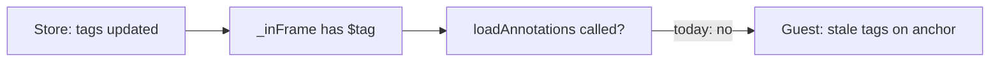

# Sync manual highlight tags to guest for palette parity

## Root cause

[`formatAnnot`](src/sidebar/services/frame-sync.ts) already sends `tags` to guests “so highlights can apply tag-based CSS classes in the page,” and [`Highlighter.highlightRange`](src/annotator/highlighter.ts) maps those tags to `h-tag-*` classes that match the injected rules from [`applyTagHighlightPalette`](src/shared/tag-highlight-styles.ts).

The gap is in [`_setupSyncToGuests`](src/sidebar/services/frame-sync.ts): `loadAnnotations` is only called for annotations that are **new** to the guest (`!this._inFrame.has(annot.$tag)`). When a user adds or edits tags on an annotation that is already anchored (e.g. manual create with `tags: []`, then add the same schema tag string as an AI row), the store updates but **no second** `loadAnnotations` runs. The guest keeps anchoring with the stale annotation object, so highlight elements never get the tag classes and keep using the default `--highlight-color`.

AI suggestion flows typically attach tags before or when the annotation is first sent to the guest, so their highlights pick up the correct classes immediately.

## Implementation

**1. Detect “guest-relevant” updates in `FrameSyncService`**

In [`onStoreAnnotationsChanged`](src/sidebar/services/frame-sync.ts) (inside `_setupSyncToGuests`), after computing `added` / `deleted`, compute a third set **`updated`**: annotations whose `$tag` is in `_inFrame` and whose **serialized** guest payload differs from the previous store snapshot.

- Build a `Map<$tag, Annotation>` from `prevAnnotations` (non-replies only, same filters as the main loop).
- For each current annotation that is in `_inFrame`, not in `added`, not a reply, and not private in a way that excludes it from guest sync (follow the same `isReply` / frame rules as today), compare `formatAnnot(prev)` to `formatAnnot(current)` using a stable equality check (e.g. `shallowEqual` on the formatted object, or explicit compare of `tags` and `$cluster`).

**Fields that matter for highlight appearance** (must match [`formatAnnot`](src/sidebar/services/frame-sync.ts)): `tags`, `$cluster`, and any other field included in `formatAnnot` if it affects classes or anchoring. Today that is `$tag`, `target`, `uri`, `$cluster`, `tags` — for **re-highlight without URI change**, `tags` and `$cluster` are the usual deltas; if `target` or `uri` change, re-sending is still correct because [`Guest.anchor`](src/annotator/guest.ts) detaches by `$tag` and re-anchors.

**2. Send `loadAnnotations` for updated annotations**

Reuse the same **per-frame batching** as the `added` path: group `updated` annotations by `frameForAnnotation(frames, annotation)` and respect the same segment / `annotationMatchesSegment` skip rules (annotations that are “not in this frame” should follow whatever the add path does for consistency).

Call `rpc.call('loadAnnotations', anns.map(formatAnnot))` for each batch.

**3. Do not duplicate work**

Ensure an annotation is not processed as both “added” and “updated” in the same tick (it should only be in `added` when newly entering the sidebar).

**4. Tests**

Update [`src/sidebar/services/test/frame-sync-test.js`](src/sidebar/services/test/frame-sync-test.js):

- Extend or add a case: after an annotation is already in the store and guest (`_inFrame`), change `tags` (and optionally `$cluster`) and assert `loadAnnotations` is called with `formatAnnot` of the **updated** annotation.
- Keep the existing “only for new annotations” test intent by renaming/clarifying: new annotations still trigger `loadAnnotations`; **updates** now trigger it too.

**5. Out of scope / follow-up**

- **Draft-only tag edits**: If tags live only in the drafts module until save, highlights may not update until the annotation in `allAnnotations` reflects the new tags. Fixing that would require syncing draft tag edits to the guest (separate, larger change). The plan above fixes the common case: tags persisted in the store (after save / autosave / merge from API).

## Files to touch

| File | Change |
|------|--------|
| [`src/sidebar/services/frame-sync.ts`](src/sidebar/services/frame-sync.ts) | Compute `updated` annotations; batch `loadAnnotations` |
| [`src/sidebar/services/test/frame-sync-test.js`](src/sidebar/services/test/frame-sync-test.js) | New test for tag update → `loadAnnotations` |

No change required to [`mergeAISearchTagHighlightPalette`](src/sidebar/helpers/ai-search-tag-palette.ts) or [`highlightTagClass`](src/shared/highlight-tag-class.ts) if the user-visible tag string matches the schema tag key (both sides use the same `highlightTagClass` normalization for CSS).
