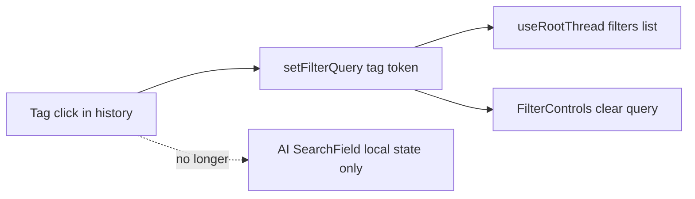

# Fix tag-click filter UX (visible filter + AI field unchanged)

## Root causes

**Issue (2) — AI field shows `tag:…`**

In `[AISearchPanel.tsx](src/sidebar/components/search/AISearchPanel.tsx)`, the AI `SearchField` uses `query={filterQuery || null}` (global store). Tag click calls `store.setFilterQuery(formatSidebarTagFilter(tagKey))`, so the same string is pushed into the textarea via `SearchField`’s sync when `query` changes (`[SearchField.tsx](src/sidebar/components/search/SearchField.tsx)` lines 126–131).

`onAISearch` does **not** set `filterQuery`; it only runs the AI flow. The textarea should represent the **AI prompt**, not the global annotation filter.

**Fix:** Keep `filterQuery` only for thread filtering (`useRootThread` / `parseFilterQuery`). Add **local state** in `AISearchPanel`, e.g. `aiSearchFieldQuery: string | null`, default `''`, and pass `**query={aiSearchFieldQuery}`** into `SearchField`. Do **not** update that state when the user clicks a history tag (only `setFilterQuery`).

- Reset `aiSearchFieldQuery` when the AI panel closes (in existing `onActiveChanged` when `!active`), alongside or instead of relying on unmount behavior, so the next open starts clean and stays consistent with `setFilterQuery(null)` on close.

**Issue (1) — filter UI not visible**

`[SidebarView.tsx](src/sidebar/components/SidebarView.tsx)` (lines 65–72) sets:

```ts
const showFilterControls =
  !hasContentError && !isSearchPanelOpen && !isAISearchPanelOpen;
```

So the floating **Filters** block is **hidden whenever the AI search panel is open**, regardless of `filterQuery`. There is even a TODO about showing filters when search/AI panels are open.

Separately, `[FilterControls.tsx](src/sidebar/components/search/FilterControls.tsx)` treats `hasFilters` as **selection + focus filters only** (lines 138–148). It **never** considers `store.filterQuery()`, so even if the panel were shown, a pure text/tag filter would not render a control.

**Fix (visibility):** Change `showFilterControls` so the main sidebar still shows `FilterControls` when the AI panel is open **if** a filter is applied, using existing `[hasAppliedFilter](src/sidebar/store/modules/filters.ts)` (which is true when `state.query` is set or focus filters exist):

- e.g. `!hasContentError && !isSearchPanelOpen && (!isAISearchPanelOpen || store.hasAppliedFilter())`

**Fix (content):** Extend `FilterControls` so `hasFilters` is true when `store.filterQuery()` is non-empty, and render an additional control (same pattern as existing `FilterToggle`s) to show that a **search/query filter** is active (truncated label if long) and **clear** it via `store.setFilterQuery(null)`.




## Files to change


| File                                                                                                   | Change                                                                                                     |
| ------------------------------------------------------------------------------------------------------ | ---------------------------------------------------------------------------------------------------------- |
| `[src/sidebar/components/search/AISearchPanel.tsx](src/sidebar/components/search/AISearchPanel.tsx)`   | `useState` for AI field `query` prop; reset on panel close; tag handler unchanged (`setFilterQuery` only). |
| `[src/sidebar/components/SidebarView.tsx](src/sidebar/components/SidebarView.tsx)`                     | Update `showFilterControls` so AI panel + `hasAppliedFilter()` still shows filters.                        |
| `[src/sidebar/components/search/FilterControls.tsx](src/sidebar/components/search/FilterControls.tsx)` | Treat `filterQuery` as an active filter; add clear toggle when non-empty.                                  |


## Tests

- Add or extend a **FilterControls** test (if a test file exists) for “renders when only `filterQuery` is set” and clear behavior.
- Optional: small **AISearchPanel** test if the project has a harness; otherwise manual check: click tag → AI textarea unchanged, floating Filters shows active query, clear removes filter.

## Scope / non-goals

- No change to `[formatSidebarTagFilter](src/sidebar/helpers/filter-query-for-tag.ts)` or tag-click calling `setFilterQuery`.
- Search panel (`searchAnnotations`) already binds `SearchField` to `filterQuery`; behavior there stays as-is.

