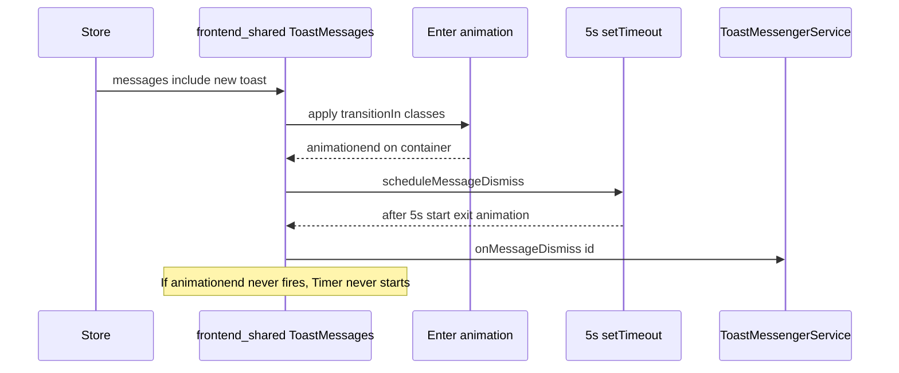

# Plan: Restore self-dismissing toasts

## How it works today

1. `**[ToastMessengerService](src/sidebar/services/toast-messenger.ts)**` adds messages to the store with `autoDismiss` (default `true`) and emits `toastMessageAdded`. The JSDoc on `_addMessage` still says it “set[s] a timeout to dismiss” but **there is no timeout in this service**—that comment is stale.
2. `**ToastMessages` from `@hypothesis/frontend-shared`** owns the real behavior (`[node_modules/@hypothesis/frontend-shared/lib/components/feedback/ToastMessages.js](node_modules/@hypothesis/frontend-shared/lib/components/feedback/ToastMessages.js)`):
  - When the **enter** transition completes, `onAnimationEnd` runs on the transition container.
  - That calls `onTransitionEnd('in', message)`, which **only then** calls `scheduleMessageDismiss` → `setTimeout` **5 seconds**, then plays the **exit** animation, then calls `onMessageDismiss(id)` (which in the sidebar maps to `[toastMessenger.dismiss](src/sidebar/components/ToastMessages.tsx)`).
3. **Sidebar vs annotator**
  - `**[src/sidebar/components/ToastMessages.tsx](src/sidebar/components/ToastMessages.tsx)`** passes a **custom** `transitionClasses.transitionIn` (`motion-safe:animate-slide-in-from-right lg:animate-fade-in motion-reduce:animate-fade-in`).
  - `**[src/annotator/components/ToastMessages.tsx](src/annotator/components/ToastMessages.tsx)`** uses **defaults** (no `transitionClasses` override).

## Likely root cause

**Auto-dismiss is gated on `animationend` for the enter transition.** If that event never fires (no effective animation, conflicting utilities, or environment where animations do not run/end as expected), `**scheduleMessageDismiss` never runs** and the user must dismiss manually (click still works via a separate path).

The sidebar’s custom `transitionIn` stack is the main suspect because it differs from the annotator path and composes several responsive/motion variants on one element.

## What we should *not* change without an explicit decision

Several call sites intentionally pass `{ autoDismiss: false }` (e.g. connection failure in `[src/sidebar/index.tsx](src/sidebar/index.tsx)`, some AI search notices in `[AISearchPanel.tsx](src/sidebar/components/search/AISearchPanel.tsx)`, moderation, export/import). The plan should **preserve** those behaviors unless you want those to auto-dismiss too.

## Recommended approach (phased)

### Phase 1 — Confirm in the browser (quick)

- Reproduce with a **default** toast (`autoDismiss` true): trigger something that uses `toastMessenger.success` / `notice` without `autoDismiss: false`.
- In DevTools, select the toast’s `[data-testid="animation-container"]` node and verify whether `**animationend` fires** when the toast appears.
- Compare **sidebar** vs **guest/annotator** if both are in use: annotator uses default transitions and may still auto-dismiss even if sidebar does not.

### Phase 2 — Low-risk local fix (try first)

In `[src/sidebar/components/ToastMessages.tsx](src/sidebar/components/ToastMessages.tsx)`, **remove the `transitionClasses` override** (or replace it with the same defaults `ToastMessages` uses internally: `animate-fade-in` / `animate-fade-out` from frontend-shared’s `[tailwind-config.css](node_modules/@hypothesis/frontend-shared/src/tailwind-config.css)`).

- **Pros:** Minimal diff, no dependency change, aligns sidebar with the tested default behavior of `ToastMessages`.
- **Cons:** Slightly different motion design (loses slide-in-from-right on larger breakpoints).

If auto-dismiss returns after this, the diagnosis is confirmed.

### Phase 3 — Robust fix if Phase 2 is insufficient or you want to keep custom motion

Change `**@hypothesis/frontend-shared`** `ToastMessages` so the 5s countdown **does not depend solely on `animationend`**—for example:

- On each new message id, schedule auto-dismiss from a `useLayoutEffect` / `useEffect` when `autoDismiss` is true (optionally still wait one `requestAnimationFrame` so the toast is painted), **or**
- Keep `animationend` as an optimization but add a **fallback timer** if `animationend` has not fired within ~1s.

Then bump the dependency in this repo and adjust tests in the shared package if any.

Also **correct the stale JSDoc** in `[toast-messenger.ts](src/sidebar/services/toast-messenger.ts)` so it no longer claims the service sets a dismiss timeout.

### Tests

- Extend or add a test that exercises sidebar `ToastMessages` with the chosen `transitionClasses` (or add an integration test that mocks `animationend` if unit tests do not run real CSS).
- Existing `[src/sidebar/components/test/ToastMessages-test.js](src/sidebar/components/test/ToastMessages-test.js)` only checks click-to-dismiss, not auto-dismiss—consider covering the timer path if you add a test seam (`setTimeout_` is already injectable on `ToastMessages`).

## Summary

| Layer                             | Role                                                       |
| --------------------------------- | ---------------------------------------------------------- |
| `ToastMessengerService`           | Stores message + `autoDismiss`; **does not** run the timer |
| `frontend-shared` `ToastMessages` | Starts 5s timer **after enter `animationend`**             |
| Sidebar wrapper                   | Custom `transitionIn` may block `animationend` → no timer  |

**Fastest fix:** drop or simplify custom `transitionClasses` in the sidebar. **Durable fix:** decouple auto-dismiss scheduling from `animationend` in `frontend-shared`.